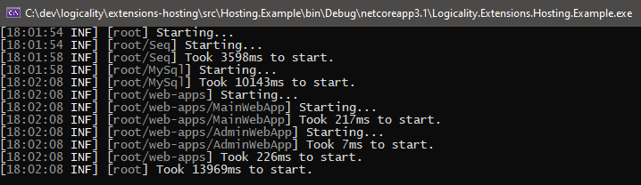

# HostedServices Extensions

The standard mechanism to run a background task is to use
[`IHostedService`][hosted-service]. The standard activation mechanism is that
each hosted service starts up sequentially - one at a time. This can take some
time if there are many services and/or if any of them are slow.



This library supplies some extensions to support:

- Starting hosted services in parallel, sequentially, or in an hierarchy.
- A pattern to share generated configuration information that is supplied from a
  hosted service.
- Helper for docker based hosted services.

The target use cases for this are "modular monoliths" or local "development
servers" that run multiple services. Consider combining with
[LittleForker](littleforker) if the hosted services are wrappers for other long
running executables.

## Packages

| Name | Package | Description |
|---|---|---|
| `Logicality.Extensions.Hosting`                      | [![feedz.io][p1]][d1] | Main package. |
| `Logicality.Extensions.Hosting.Docker`               | [![feedz.io][p2]][d2] | Docker specific hosted service helper. |
| `Logicality.Extensions.Hosting.SerilogConsoleLogging` | [![feedz.io][p3]][d3] | Opinionated console logger. |

## Using

Using standard mechanism, these services will be started one after the other:

```csharp

var hostBuilder = new HostBuilder()
    .ConfigureServices(services =>
    {
        services.AddHostedService<Foo>();
        services.AddHostedService<Bar>();
        services.AddHostedService<Baz>();
    })

```

With this library, these services are started in parallel and thus potentially
faster overall on a multi-core system:

```csharp

services.AddParallelHostedServices("webapps", w => w
    .Host<Foo>()
    .Host<Bar>()
    .Host<Baz>());

```

Some services will depend on other services so it's possible to explicitly
specify a sequential set. Here, the `API` hosted service depends on
connection string generated by the `MySql` hosted service so we start that
first:

```csharp
services.AddSequentialHostedServices("root", r => r
    .Host<MySql>()
    .Host<ApiWebApp>());
```

It is possible to combine sequential and parallel hosted services in a hierarchy
to get the optimum balance between start up performance and dependency chain:

```csharp

services.AddSequentialHostedServices("root", r => r
    .HostParallel("containers",  // the name is used for logging.
        p => p
            .Host<LocalStack>()
            .Host<MySql>()));
    .HostParallel("web-apps",
        p => p
            .Host<AdminWebApp>()
            .Host<ApiWebApp>());

```

See [example project][example-project] for a more complete runnable.

## Acknowledgements

Portions and concepts originally produced with [LykkeCorp](lykkecorp) under MIT Licence.

---

[hosted-service]: https://docs.microsoft.com/en-us/dotnet/architecture/microservices/multi-container-microservice-net-applications/background-tasks-with-ihostedservice
[p1]: https://img.shields.io/badge/endpoint.svg?url=https%3A%2F%2Ff.feedz.io%2Flogicality%2Fpublic%2Fshield%2FLogicality.Extensions.Hosting%2Fstable
[d1]: https://f.feedz.io/logicality/public/packages/Logicality.Extensions.Hosting/stable/download
[p2]: https://img.shields.io/badge/endpoint.svg?url=https%3A%2F%2Ff.feedz.io%2Flogicality%2Fpublic%2Fshield%2FLogicality.Extensions.Hosting.Docker%2Fstable
[d2]: https://f.feedz.io/logicality/public/packages/Logicality.Extensions.Docker/stable/download
[p3]: https://img.shields.io/badge/endpoint.svg?url=https%3A%2F%2Ff.feedz.io%2Flogicality%2Fpublic%2Fshield%2FLogicality.Extensions.Hosting.SerilogConsoleLogging%2Fstable
[d3]: https://f.feedz.io/logicality/public/packages/Logicality.Extensions.Hosting.SerilogConsoleLogging/stable/download
[example-project]: /src/Hosting.Example
[lykkecorp]: https://lykke.com
[littleforker]: https://github.com/damianh/LittleForker
